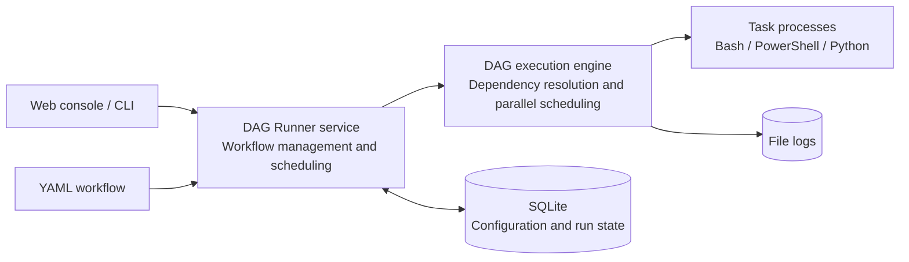

[中文](README.md) | [English](README.en.md)

# DAG Runner

A simple, lightweight, cross-platform Python DAG workflow runner.

Define tasks and dependencies in YAML, start one service, and use the browser to configure schedules, inspect DAGs, start or stop runs, resume failed runs, and read logs. There is no need to maintain an operating-system cron entry for every workflow or deploy a distributed scheduler cluster.


## Architecture



## Features

- **Lightweight and single-node:** Flask, SQLite, and APScheduler; no Redis, message queue, or external database
- **Easy migration:** import DolphinScheduler JSON and Windows Task Scheduler XML as DAG Runner workflows
- **DAG execution:** dependency and cycle validation, parallel execution of ready tasks, stop, rerun, and resume support
- **Centralized management:** import and edit workflows, configure schedules, inspect DAGs, and read task logs in the web console
- **Login protection:** username/password login, 36-hour sessions, and a 10-minute IP block after three consecutive failures
- **Cross-platform:** Bash on Linux and PowerShell on Windows, including Conda activation in workflow `setup`

## Quick start

### 1. Create the runtime environment

Using a dedicated Conda environment is recommended:

```bash
git clone https://github.com/kbxu/DAG-Runner.git
cd DAG-Runner
conda create -n dagr python=3.11.* -y
conda activate dagr
python -m pip install -r requirements.txt
```

### 2. Create the first login account

After activating the environment and installing dependencies, run:

```bash
python -m dagrunner.auth --generate
```

DAG Runner has no default password. This command creates or resets the `admin` account and prints a randomly generated strong password once. Save it immediately. Alternatively, omit `--generate` and enter a password of at least 16 characters when prompted. Run the command again to reset a lost password; existing sessions are invalidated immediately.

If the server uses a custom database path, use the same path when creating the account:

```bash
python -m dagrunner.auth --db /path/to/scheduler.db --generate
```

### 3. Start the service and sign in

```bash
python -m dagrunner.server
```

Open <http://127.0.0.1:7119> and sign in as `admin` with the generated password. Database tables are created automatically when the service starts.

`dagrunner.server` options:

| Option | Default | Description |
| --- | --- | --- |
| `--host` | `127.0.0.1` | HTTP listen address; use `0.0.0.0` to accept connections from other machines |
| `--port` | `7119` | HTTP listen port |
| `--db` | `var/scheduler.db` | SQLite database path |
| `--logs` | `var/logs` | Workflow and task log directory |
| `--threads` | `8` | Task execution thread-pool size |
| `--language` | `zh-CN` | Default web language; `zh-CN` or `en`. It can also be switched from the top-right button |
| `--allow-insecure-remote-login` | off | Allow non-local clients to keep sessions over HTTP; use only temporarily on a trusted network |

Example for trusted LAN access with custom data paths:

```bash
python -m dagrunner.server \
  --host 0.0.0.0 \
  --port 7119 \
  --db var/scheduler.db \
  --logs var/logs \
  --threads 8 \
  --language en \
  --allow-insecure-remote-login
```

The browser first hashes the login password with SHA-256. The backend then stores a salted PBKDF2-HMAC-SHA256 verifier with 600,000 iterations. The browser hash is still a replayable credential and does not replace transport encryption. Non-local deployments must use HTTPS and set `DAGRUNNER_COOKIE_SECURE=1` so session cookies are sent only over HTTPS.

For temporary HTTP use on a trusted LAN, pass both `--host 0.0.0.0` and `--allow-insecure-remote-login`. This permits HTTP session cookies and enables the page's built-in SHA-256 implementation when Web Crypto is unavailable. It also permits HTTP login even when `DAGRUNNER_COOKIE_SECURE=1` is set, so never use it on the public internet.

### 4. Define or import a workflow

Workflows use YAML to describe tasks, dependencies, setup scripts, and schedules. See the complete [example workflow](demo/examples/dagr_example_pipeline.yaml). In the web console, select **New workflow** to edit the example or **Import workflow** to choose an existing file. Imported schedules are disabled by default; review commands, dependencies, working directories, and schedule times before enabling them.

The import dialog automatically recognizes:

- DAG Runner YAML
- DolphinScheduler JSON, such as this [example export](demo/examples/ds_9000001001.json)
- Windows Task Scheduler XML, such as this [example export](demo/examples/ts_market_report.xml)

DolphinScheduler and Windows exports are converted in memory with default options. The detected source is shown above the editor and no intermediate file is written. Multiple convertible calendar triggers in one Windows task remain in a single workflow and share one timezone.

The DolphinScheduler converter currently supports only `SHELL` (Bash) and `CONDITIONS` nodes. Other node types are omitted and the import preview asks for manual review.

#### Manual conversion with environment options

Use the command-line converter when a migration needs a working directory, Conda environment, or environment variables. For example:

```bash
python -m dagrunner.migrate_workflows \
  --source dolphinscheduler \
  data/ds_workflow.json \
  --setup-file templates/production_setup.sh
```

For Windows Task Scheduler, use `--source windows-task-scheduler` with the exported XML file. A PowerShell setup script can be supplied with `--setup-file templates/production_setup.ps1`. Then import the generated `dagr_<source filename>.yaml` from the web console.

Manual conversion options:

| Option | Required | Description |
| --- | --- | --- |
| `--source` | yes | `dolphinscheduler` or `windows-task-scheduler` |
| `EXPORT` | yes | One or more JSON/XML export paths; this is a positional placeholder, not a literal argument |
| `--output-dir` | no | YAML output directory; defaults to the source file's directory |
| `--setup-file` | no | Workflow setup script; `.ps1`/`.psm1` uses PowerShell, all other files use Bash |
| `--exclude-disabled` | no | Omit disabled nodes and dependency edges connected to them |
| `--timezone` | no | Timezone, default `Asia/Shanghai`; mainly used for Windows triggers |

Conversion reads and writes configuration only; it never executes commands from an export.

## CLI

```bash
# Run a workflow
python -m dagrunner --workflow workflow_000001

# List run history
python -m dagrunner --workflow workflow_000001 --list-runs

# Resume from a specific failed task
python -m dagrunner --workflow workflow_000001 --from transform_data

# Read a task log
python -m dagrunner --show-log --run-id <run_id> --task transform_data
```

## Project structure

```text
dagrunner/        Core code, web templates, and static assets
demo/tasks/       Safe, fictional example task scripts
demo/examples/    Public ds_*.json, ts_*.xml, and dagr_*.yaml examples
templates/        Production Bash and PowerShell setup templates
data/             Private migration data, ignored by Git
var/              SQLite, logs, and local runtime data, ignored by Git
docs/images/      README images
```

## Deployment and security

The service listens on `127.0.0.1` by default. Add authentication and HTTPS through a reverse proxy before opening it to a LAN or the internet. Workflow YAML can execute system commands; manage it as trusted code and run the service under a low-privilege account.

The operating system only needs to keep the `python -m dagrunner.server` process alive. DAG Runner manages individual workflow schedules internally.

## License

[MIT](LICENSE)
