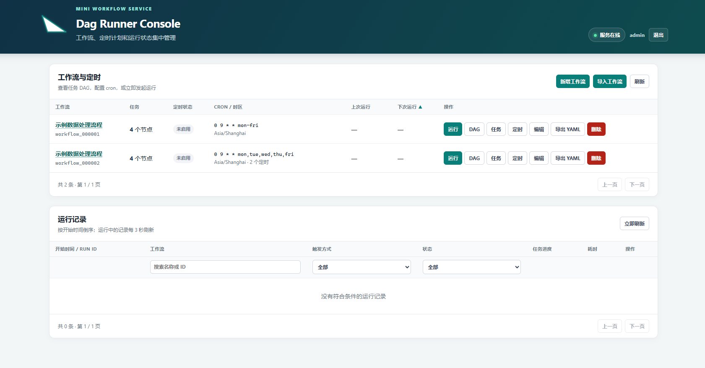
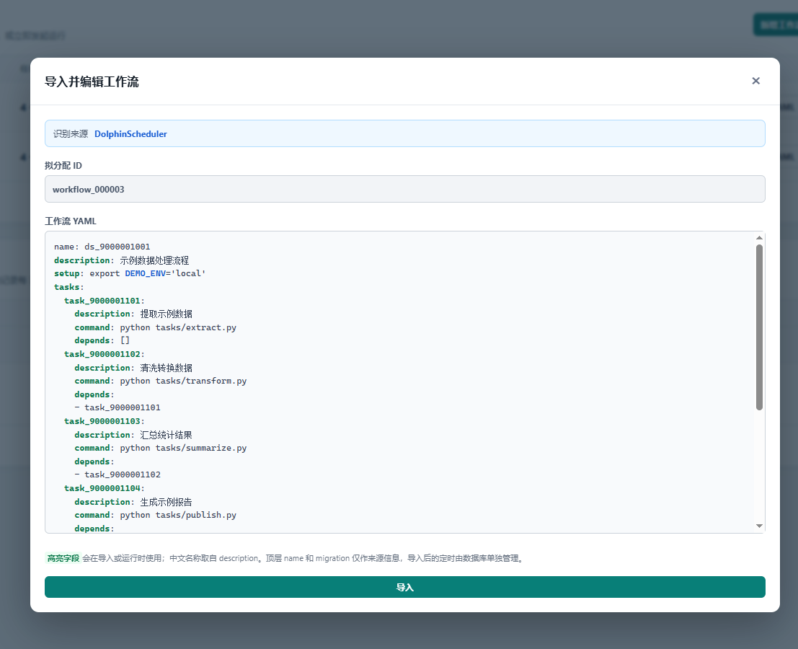
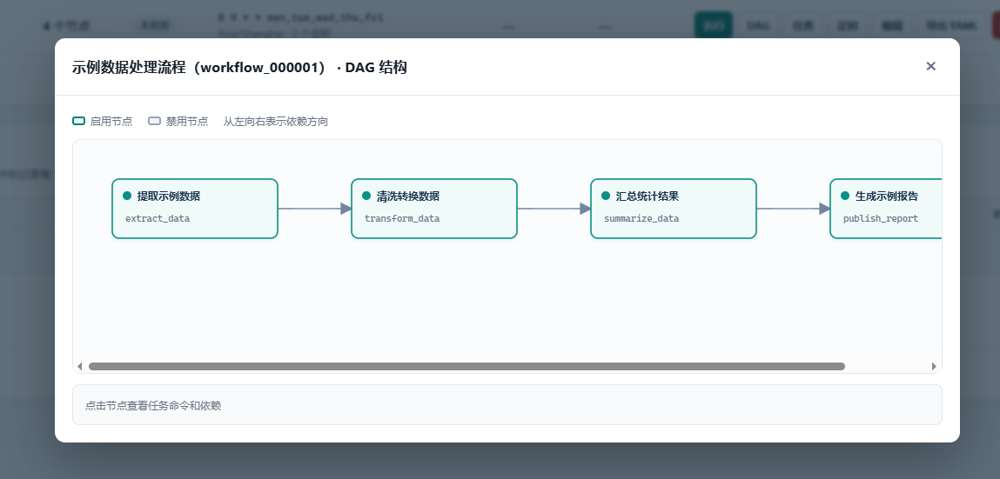
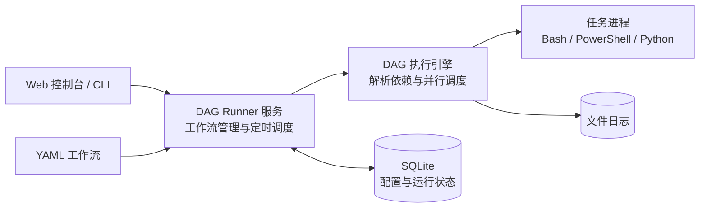

[中文](README.md) | [English](README.en.md)

# DAG Runner

一个简单、轻量、跨平台的 Python DAG 工作流运行器。

用 YAML 定义任务和依赖，启动一个服务，就可以在浏览器里配置定时、查看 DAG、运行任务、停止任务、失败续跑和查看日志。不需要为每个工作流维护系统 cron，也不需要部署分布式调度集群。





## 系统架构


## 特性

- **单机轻量**：Flask、SQLite 和 APScheduler 即可运行，不依赖 Redis、消息队列或外部数据库
- **方便迁移**：可把 DolphinScheduler JSON 和 Windows Task Scheduler XML 转换为 DAG Runner YAML
- **DAG 执行**：自动校验依赖和环路，并行执行就绪任务，支持停止、重跑和失败续跑
- **集中管理**：通过 Web 页面导入和编辑工作流、配置定时、查看运行 DAG 与任务日志
- **登录保护**：账号密码登录、36 小时会话，以及连续失败 3 次后按 IP 封禁 10 分钟
- **跨平台**：Linux 使用 Bash，Windows 使用 PowerShell，支持在 `setup` 中激活 Conda 环境

## 快速开始

### 1. 创建运行环境

推荐先使用 Conda 创建并激活独立环境，再安装项目依赖：

```bash
git clone https://github.com/kbxu/DAG-Runner.git
cd DAG-Runner
conda create -n dagr python=3.11.* -y
conda activate dagr
python -m pip install -r requirements.txt
```

### 2. 创建首次登录账号

确认上述 Conda 环境已经激活且依赖安装完成后，执行：

```bash
python -m dagrunner.auth --generate
```

DAG Runner 不提供默认密码。该命令会创建或重置管理员账号 `admin`，并且只在终端中
显示一次随机强密码，请立即妥善保存。也可以不传 `--generate`，按提示手工输入至少
16 位的密码。密码遗失时可重新执行该命令进行重置，重置后已有登录会话会立即失效。

如果启动服务时通过 `--db` 指定其他数据库文件，创建账号时必须使用相同路径，例如：

```bash
python -m dagrunner.auth --db ./var/scheduler.db --generate
```

### 3. 启动并登录

```bash
python -m dagrunner.server
```

启动后访问 <http://127.0.0.1:7119>，使用账号 `admin` 和刚生成的密码登录。数据库表会在
服务启动时自动创建，无需手工建表。

`dagrunner.server` 参数：

| 参数 | 默认值 | 说明 |
| --- | --- | --- |
| `--host` | `127.0.0.1` | HTTP 服务监听地址；需要允许其他机器访问时可设为 `0.0.0.0` |
| `--port` | `7119` | HTTP 服务监听端口 |
| `--db` | `var/scheduler.db` | SQLite 数据库文件路径 |
| `--logs` | `var/logs` | 工作流和任务日志目录 |
| `--threads` | `8` | 任务执行线程池大小 |
| `--language` | `zh-CN` | Web 默认语言；可选 `zh-CN` 或 `en`，页面右上角也可随时切换 |
| `--allow-insecure-remote-login` | 关闭 | 允许非本机客户端通过 HTTP 保持登录，仅建议在可信局域网临时使用 |

例如，允许局域网访问并使用自定义数据目录：

```bash
python -m dagrunner.server \
  --host 0.0.0.0 \
  --port 7119 \
  --db var/scheduler.db \
  --logs var/logs \
  --threads 8 \
  --allow-insecure-remote-login
```

Web 登录的密码会先在浏览器中计算 SHA-256，再由后端使用随机盐和
PBKDF2-HMAC-SHA256（600,000 次迭代）生成数据库校验值。前端摘要仍然属于可重放的
密码凭据，不能代替传输加密；非本机部署必须启用 HTTPS，并设置
`DAGRUNNER_COOKIE_SECURE=1`，确保会话 Cookie 只通过 HTTPS 发送。确需在可信局域网中
使用 HTTP 时，可同时指定 `--host 0.0.0.0 --allow-insecure-remote-login`；该参数会允许
HTTP 会话 Cookie，并在浏览器 Web Crypto 不可用时启用页面内置的 SHA-256 实现。即使
设置了 `DAGRUNNER_COOKIE_SECURE=1`，该模式也允许 HTTP 登录，因此不应在公网环境中使用。

### 4. 定义或导入工作流

工作流使用 YAML 描述任务、依赖、准备脚本和定时配置，完整格式可参考
[示例工作流](demo/examples/dagr_example_pipeline.yaml)。登录 Web 控制台后，可以点击“新增工作流”
基于示例编辑，也可以点击“导入工作流”选择已有文件。导入后的调度默认关闭，请检查命令、
依赖关系、工作目录和调度时间后再手动启用。

“导入工作流”可以直接识别以下格式：

- DAG Runner YAML
- DolphinScheduler 导出的 JSON，例如 [示例文件](demo/examples/ds_9000001001.json)
- Windows 任务计划程序导出的 XML，例如 [示例文件](demo/examples/ts_market_report.xml)

DolphinScheduler 和 Windows 文件会使用默认参数在内存中转换，编辑框顶部会标记识别到的
来源，不会生成中间文件。一个 Windows 任务中的多个可转换日历触发器会保留在同一个工作流
中，并共享一个时区。

目前 DolphinScheduler 转换仅支持 `SHELL`（Bash）和 `CONDITIONS` 两类节点；其他类型会被
省略，并在导入预览中提示人工检查。

#### 需要附加环境参数时手动转换

如果迁移时需要注入工作目录、Conda 环境或环境变量，可以先使用命令行手动转换。例如：

```bash
python -m dagrunner.migrate_workflows \
  --source dolphinscheduler \
  data/ds_workflow.json \
  --setup-file templates/production_setup.sh
```

Windows 任务计划程序使用 `--source windows-task-scheduler`，并传入导出的 XML 文件；
PowerShell 环境准备脚本可以使用 `--setup-file templates/production_setup.ps1`。转换完成后，
再从 Web 控制台导入生成的 `dagr_<源文件名>.yaml`。

手动转换可用参数：

| 参数 | 是否必填 | 说明 |
| --- | --- | --- |
| `--source` | 是 | `dolphinscheduler` 或 `windows-task-scheduler` |
| `EXPORT` | 是 | 一个或多个 JSON/XML 导出文件路径；这是位置参数，不要输入字面量 `EXPORT` |
| `--output-dir` | 否 | YAML 输出目录；默认写入源文件所在目录 |
| `--setup-file` | 否 | 注入工作流级准备脚本；`.ps1`/`.psm1` 按 PowerShell 处理，其余按 Bash 处理 |
| `--exclude-disabled` | 否 | 不转换已禁用节点及与其相连的依赖边 |
| `--timezone` | 否 | 时区，默认 `Asia/Shanghai`；主要用于转换 Windows 触发器 |

转换过程只读写配置，不会执行导出文件中的命令。

## CLI

```bash
# 运行工作流
python -m dagrunner --workflow workflow_000001

# 查看历史
python -m dagrunner --workflow workflow_000001 --list-runs

# 从指定失败任务继续
python -m dagrunner --workflow workflow_000001 --from transform_data

# 查看任务日志
python -m dagrunner --show-log --run-id <run_id> --task transform_data
```

## 项目结构

```text
dagrunner/        核心代码、Web 页面和静态资源
demo/tasks/       可安全运行的虚构示例任务脚本
demo/examples/    ds_*.json、ts_*.xml 和 dagr_*.yaml 公开示例
templates/        Bash 和 PowerShell 生产 setup 模板
data/             私有迁移数据，Git 忽略
var/              SQLite、日志和本地运行数据，Git 忽略
docs/images/      README 首页图片
```

## 部署与安全

服务默认只监听 `127.0.0.1`。开放到局域网或互联网前，请通过反向代理增加身份认证和 HTTPS。工作流 YAML 可以执行系统命令，应当按可信代码管理，并使用低权限服务账户运行。

操作系统只需负责常驻 `python -m dagrunner.server` 进程；具体工作流定时由服务内部管理。

## License

[MIT](LICENSE)
